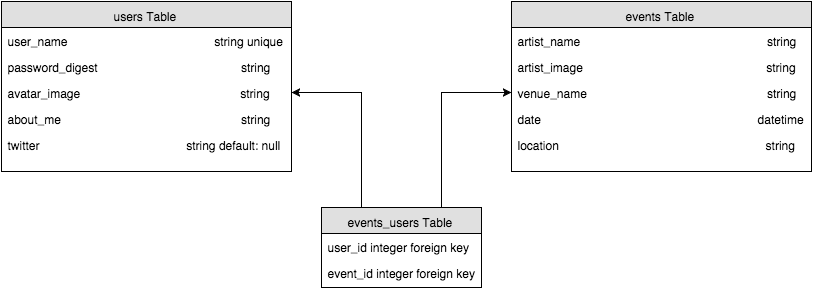
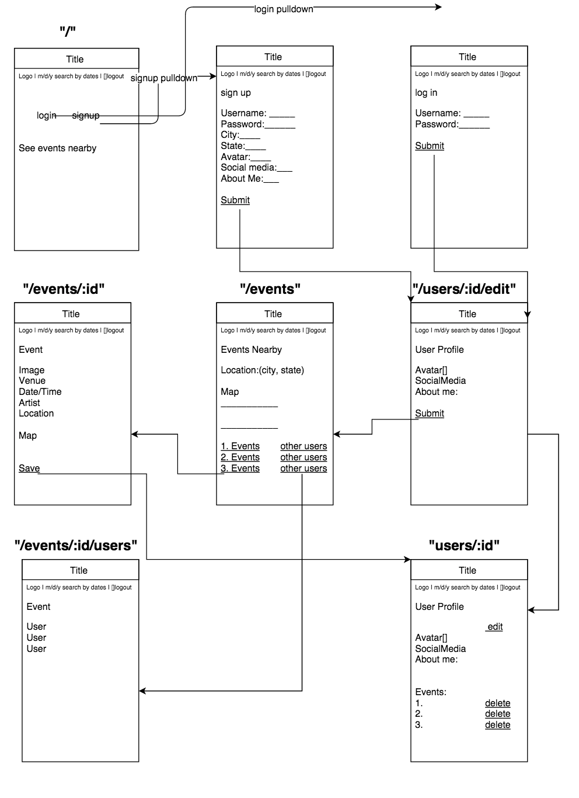

# BandNextDoor

Description (3 Points)
A short description of your Application
Team members
Technologies used
A link to your Trello board
User Stories (3 Points)
Front-end Wireframes (3 Points)
Routes (3 Points)
Database Design (ERD/Data Model Diagrams) (3 Points)
## Overview
An application to find same day live music events nearby.

##### Designed & Developed by Team Niner (Four Points of the Compass):
* **Alexander Marino (Alexander the Great)**

* **Daniel Khalili (Donkey Kong)**

* **Ben Aplin**

* **Colleen McCaffrey**

##### Technologies Used:
* Ruby on Rails
* jQuery
* Foundation CSS
* PostgreSQL

##### Trello
[Private Trello Board](https://trello.com/b/sO7tRKSY/niner-ga-project-3)

#### ERD

#### Wireframes

### User Stories
Users can login, edit profile with avatar, link to twitter account and an about me section.
Users can search events by date.
A user can save an event in their profile.
Users can delete saved events.
Users can see the profiles of other users who have also saved the same event. Banding together.

### Routes
*Need to add routes- rake routes
